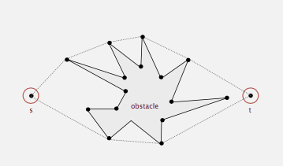
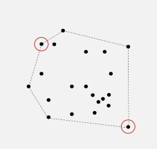
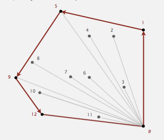
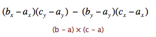
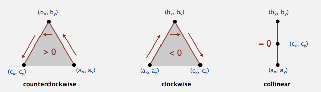

###Convex hull凸包问题和Graham算法
@(算法)

----------
引入凸包问题前先复习一下**向量的知识**。
在二维空间中，向量定义方向和长度，用一对坐标$x,y$来表示。
向量的加法和减法就不加以赘述了，重点讲述向量的点乘和叉乘。
$A B=x1*x2+y1*y2$，$A B=|A||B|cos\Theta$
点乘得到的是个标量，这个公式可以轻易计算两向量间的夹角$\Theta$
**重点是**叉乘：$A X B=x1*y2-y1*x2=|A||B|sin\Theta$
叉乘得到的是向量，方向符合右手螺旋法则，垂直于向量A、B所在的平面。
当A、B夹角小于180度，值为正值，否则为负值。
而且，在二维空间向量中，以**`逆时针`**方向为正方向。

----------
**凸包定义：**N个点构成一个集合set，有这么一个凸多边形，它的顶点是集合中的点，且这个凸多边形包含了集合中的所有点，称这个凸多边形为**“凸包”**。
输入：一系列点构成的集合；
输出：凸包顶点按逆时针顺序的序列。

凸包问题应用：
1、机器运动规划：找到点**S**到点**T**的避开障碍物的最短路径。

2、最远配对问题：
给定N个点在同一平面上，找到它们中有最大欧几里得距离的一对点：

----------
解决方案：
1、找出N个点钟纵坐标最小的点，标记为p；
2、计算出其余点相对于点p的极坐标角度，并按照角度**`排序`**，依次标记为点p1,p2,p3......

3、依次判断每个点$pi$，如果新加入的点没有构成凸多边形性质，则说明这个点不是凸包的顶点。
如何界定新加入的点有没有构成凸多边形性质：例如，新加入点为点P2，则查看点2是否在PP1直线左侧，即PP1和PP2的夹角是否在0~+180度，亦即直线PP1逆时针转动0~180度能到PP2直线。
数学表达式求解：A-B-C是否逆时针旋转。

如果结果：
- >0，A-B-C逆时针旋转；
- <0，A-B-C顺时针旋转；
- =0，A-B-C在一条直线上。

----------
####代码思路：
1、查找给定点集中y坐标最小的点—P0;
2、求出其他点相对于点P0的角度，并按照角度排序;
3、依次求出各点是否满足逆时针旋转CCW的关系，过程：
将P0、P1压入堆栈，判断P2是否满足ccw关系，如满足则将p2压栈，不满足则将P1出栈，一直到迭代了所有点。此时栈中的元素即为凸包的顶点。

    package com.algotithm;

	import edu.princeton.cs.algs4.Stack;
	import edu.princeton.cs.algs4.StdIn;
	
	import java.awt.*;
	import java.io.FileInputStream;
	import java.io.FileNotFoundException;
	import java.util.Arrays;
	import java.util.Comparator;
	import java.util.Iterator;
	
	
	public class Convexhull {
	    private Point[] points;
	    private int N;
	    private Point[] outPoint;

	    public Convexhull(int N, Point[] points) {
	        this.N = N;
	        this.points = points;
	    }
	
	    public int getLeastyPoint() {//返回纵坐标最小的点的索引；
	        int minyindex = 0;
	        for (int i = 1; i < N; i++) {
	            if (points[minyindex].y > points[i].y)
	                minyindex = i;
	        }
	        return minyindex;
	    }
	
	    public int AngleTwoPoints(Point point) {//和点P0点的连线与横轴的夹角，即P0Pi向量和（0，1）向量夹角余弦值
	        int yleast = getLeastyPoint();
	        if (point.x == points[yleast].x && point.y == points[yleast].y)
	            return 0;
	        else
	            return (int) (Math.acos((point.x - points[yleast].x) / (Math.sqrt(Math.pow(point.x - points[yleast].x, 2) + Math.pow(point.y - points[yleast].y, 2)))) * 180);
	    }
	
	    class AngleComparator implements Comparator<Point> {
	        @Override
	        public int compare(Point o1, Point o2) {//值大于0，说明o1离P0得角度大,o2就排在前面
	            return AngleTwoPoints(o1) - AngleTwoPoints(o2);
	        }
	    }
	
	    public void sort() {
	        Arrays.sort(points, new AngleComparator());
	    }
	
	    public Point[] OutPoint() {
	        Stack<Point> stack = new Stack<>();
	        int size = 0;
	        stack.push(points[0]);
	        stack.push(points[1]);
	        for (int i = 2; i < N; i++) {
	            Point a, b;
	            Iterator<Point> iterator = stack.iterator();
	            b = iterator.next();
	            a = iterator.next();//
	            if (ccw(a, b, points[i]) > 0)
	                stack.push(points[i]);
	            else {
	                stack.pop();
	                i--;
	            }
	        }
	        size = stack.size();
	        outPoint = new Point[size];
	        for (int j = 0; j < size; j++) {//栈最底部是原点，需除去；
	            outPoint[size - 1 - j] = stack.pop();
	        }
	        return outPoint;
	    }
	
	    public static int ccw(Point a, Point b, Point c) {
	        double area = (b.x - a.x) * (c.y - a.y) - (c.x - a.x) * (b.y - a.y);
	        if (area < 0) return -1;
	        else if (area > 0) return 1;
	        else return 0;
	    }
	
	    public static void main(String[] args) {
	        try {
	            FileInputStream input = new FileInputStream("/Users/guanglinzhou/Desktop/Convexhull.txt");
	            System.setIn(input);
	        } catch (FileNotFoundException e) {
	            e.printStackTrace();
	        }
	        int N = StdIn.readInt();
	        Point[] points = new Point[N];
	        Point[] outPoint;
	        int x, y;
	        for (int i = 0; i < N; i++) {
	            x = StdIn.readInt();
	            y = StdIn.readInt();
	            points[i] = new Point(x, y);
	        }
	        Convexhull convexhull = new Convexhull(N, points);
	        convexhull.sort();
	        outPoint = convexhull.OutPoint();
	        print(outPoint);
	        System.out.println("--------- ");
	    }
	
	    public static void print(Point[] points) {
	        for (Point p : points) {
	            System.out.print(p.x + "  " + p.y);
	            System.out.println();
	        }
	    }
	}

