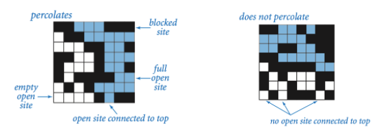

####Percolation(渗透)问题
@(算法)
[Coursera作业链接](http://coursera.cs.princeton.edu/algs4/assignments/percolation.html)

----------
实际问题：将一个不透水的均质方块分割为N*N，最上方为水源，随机打开方块中任意格子，重复此项操作多次，产生一条路径使水能穿过这个方块到达最下方。

#####the model
percolation系统使用n-n格点，每个格点site有open/blocked两种状态，如果最上面一行和最底下一行有路径联通，那说明这个系统是percolates的。

----------
这个问题可以和之前学过dynamic-connectivity问题相联系，因为当open一个site后，这个site需要和周边的open site相连接，这里可以使用quick-find、qucik-union、weighted-quickunion算法。
这个问题看起来比较复杂，实则核心就是进行动态连接。

----------
一开始编写代码或者分析的时候思路比较混乱，我使用了二维数组$a[row][col]$来代表这个方形系统，后来直接用一维数组来表达这个方形系统。
类**Percolation**和使用的**WeightedQuickUnionUF**算法中均有数组来表达这个方形格点，搞得很混乱。

----------

仔细想想，捋清思路，感觉解决算法问题，数据结构的定义和使用需要非常清楚，弄清楚会有事半功倍的效果。

`这个实际问题和动态连接区别在于，每个site不仅需要和别的site相连，本身还具备open/block的性质，所以需要单独定义一个数组表示site的open/block性质`

之前出现的程序编写之所以不正确，或者思路混乱，是因为数据结构没有理解清楚。本题中的site既要有open&blocked的性质，又得进行Union操作，那本来WeightedQuickUnionUF中只有一组数组用来进行Union，所以我们需要另外定义一组数组来表示Open&blocked性质。同时这两组数组通过下标“对齐”的方式，来展现的就是对一个site进行操作。

我在类**Percolation**中定义了一个成员~一维数组**a**用来表示方形系统中每个节点的open/blocked状态，

    a[i]=true;//表示site open
    a[i]=false;//表示site blocked
定义了一个成员~类**WeightedQuickUnionUF**对象，这个对象内的数组表示连接情况,
并且**下标0表示virtual top site，下标N*N+1表示virtual bottom site.**

----------
这里简化以3*3方形系统为例：
**方形系统：**
| 1    |     2 | 3|
| :-------- :| :--------:| :--------:| 
| 4   |   5 |  6 |
|7|8|9|
**数组a：**
| 0   |     1 | 2|
| :-------- :| :--------:| :--------:| 
| 3   |   4 |  5|
|6|7|8|
**WeightedQuickUnionUF类中的数组：**
0表示vitual top site
| 1    |     2 | 3|
| :-------- :| :--------:| :--------:| 
| 4   |   5 |  6 |
|7|8|9|
10表示vitual bottom site
注意：在定义的Percolation类中的方法对site的索引都是通过$(row,col)$，所以涉及到一个**`数组下标转化问题`**

例如：$(row,col)$来索引方形系统，在数组a中即查看对应site的状态时，$a[(row-1)*N+col-1]$
而进行连接时对应$(row,col)$位置的site映射为下标为$(row-1)*N+col$

具体代码：

    import edu.princeton.cs.algs4.StdIn;
	import edu.princeton.cs.algs4.WeightedQuickUnionUF;
	import java.io.FileInputStream;
	import java.io.FileNotFoundException;
	
	public class Percolation {
	    private WeightedQuickUnionUF weightedQuickUnionUF;
	    private boolean[] a;
	    private int N;
	    private int numberopen;

	    public Percolation(int n) {
	        N = n;//N*N gird system
	        numberopen = 0;//open sites number
	        if (n <= 0)
	            throw new IllegalArgumentException("n must be a positive number.");
	        weightedQuickUnionUF = new WeightedQuickUnionUF(n * n + 2);
	        a = new boolean[n * n];
	    }
	
	    public boolean isOpen(int row, int col) {
	        return a[(row - 1) * N + col - 1] == true;
	    }
	
	    public boolean isFull(int row, int col) {//connected to an open site in the top row
	        return weightedQuickUnionUF.connected((row - 1) * N + col, 0);
	    }
	
	    public int numberOfOpenSites() {
	        return numberopen;
	    }
	
	    public boolean percolates() {
	        return weightedQuickUnionUF.connected(0, N * N + 1);
	    }
	
	    public boolean outOfIndices(int row, int col) {
	        if ((row > 0 && row <= N) && (col > 0 && col <= N))
	            return false;
	        return true;
	    }
	
	    public void open(int row, int col) {
	        if (outOfIndices(row, col))
	            throw new IllegalArgumentException("outOfIndices......");
	        if (isOpen(row, col))
	            return;
	        if (row == 1) {//top sites
	            weightedQuickUnionUF.union(0, (row - 1) * N + col);
	            a[(row - 1) * N + col - 1] = true;
	        } else if (row == N) {
	            weightedQuickUnionUF.union(N * N + 1, (row - 1) * N + col);
	            a[(row - 1) * N + col - 1] = true;
	        }
	        if (!outOfIndices(row - 1, col) && isOpen(row - 1, col)) {//上site
	            weightedQuickUnionUF.union((row - 1) * N + col, (row - 2) * N + col);
	            a[(row - 1) * N + col - 1] = true;
	        }
	        if (!outOfIndices(row + 1, col) && isOpen(row + 1, col)) {//下site
	            weightedQuickUnionUF.union(row * N + col, (row - 1) * N + col);
	            a[(row - 1) * N + col - 1] = true;
	        }
	        if (!outOfIndices(row, col - 1) && isOpen(row, col - 1)) {//左site
	            weightedQuickUnionUF.union((row - 1) * N + col - 1, (row - 1) * N + col);
	            a[(row - 1) * N + col - 1] = true;
	        }
	        if (!outOfIndices(row, col + 1) && isOpen(row, col + 1)) {//右site
	            weightedQuickUnionUF.union((row - 1) * N + col, (row - 1) * N + col + 1);
	            a[(row - 1) * N + col - 1] = true;
	        }
	        if (!outOfIndices(row, col + 1)) {
	            a[(row - 1) * N + col - 1] = true;
	        }
	        numberopen++;
	    }
	
	    public static void main(String[] args) {
	        try {
	            FileInputStream input = new FileInputStream("/Users/guanglinzhou/Downloads/percolation/input50.txt");
	            System.setIn(input);
	        } catch (FileNotFoundException e) {
	            e.printStackTrace();
	        }
	        int n = StdIn.readInt();
	        Percolation percolation = new Percolation(n);
	        while (!StdIn.isEmpty()) {
	            int i = StdIn.readInt();
	            int j = StdIn.readInt();
	            percolation.open(i, j);
	        }
	        System.out.println(percolation.percolates());
	        System.out.println(percolation.numberOfOpenSites());
	    }
	}

带入[Coursea-Testing数据](https://www.coursera.org/learn/algorithms-part1/programming/Lhp5z/percolation 验证基本正确的，但存在一个问题，也是共性问题-backwash问题。

----------

在程序中，每次top/bottom行的site open 后默认连接到vitual top/bottom site，导致最下层的site并没有percolate但是也算在里面了。

----------
参考[这篇博客](http://www.cnblogs.com/anne-vista/p/4841732.html)，还是只用一个WeightedQuickUnionUF，但新建两个成员数组表示该site是否连接到Top/Bottom，如果某个site既connect top又connect bottom，说明system is connected，然后查看两数组Top/Bottom查看Bottom数组中值为true但在Top数组中值为false的索引，这些索引所对应的site即为backwash部分。